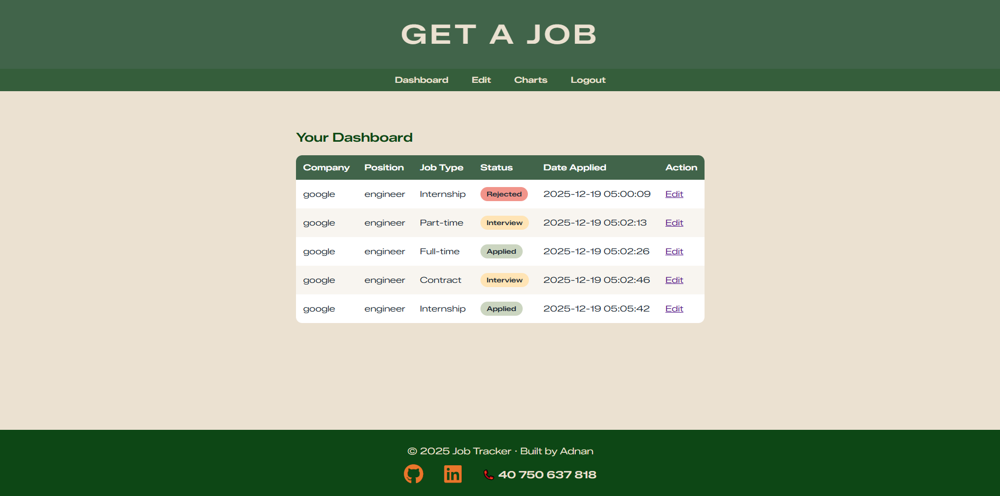
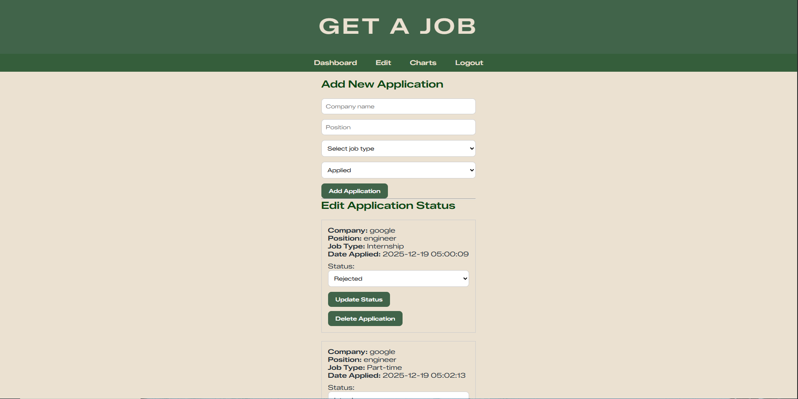
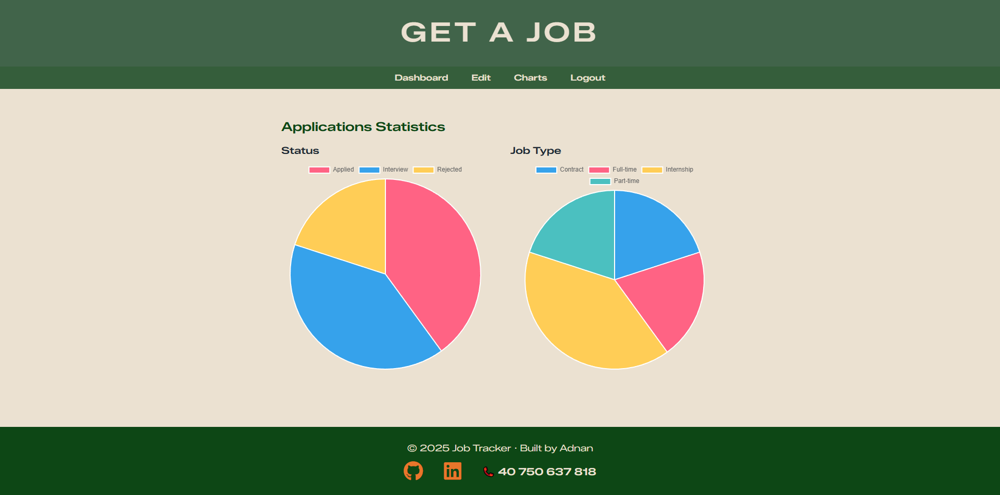
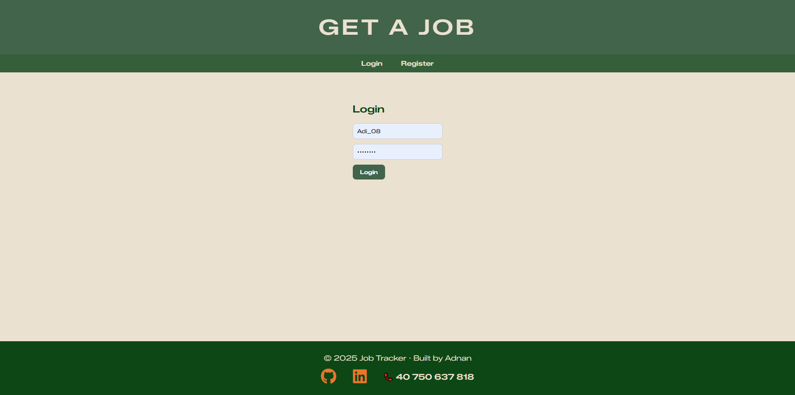
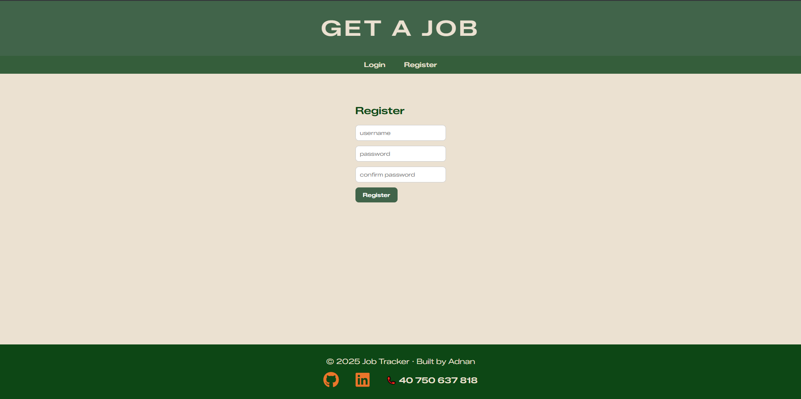
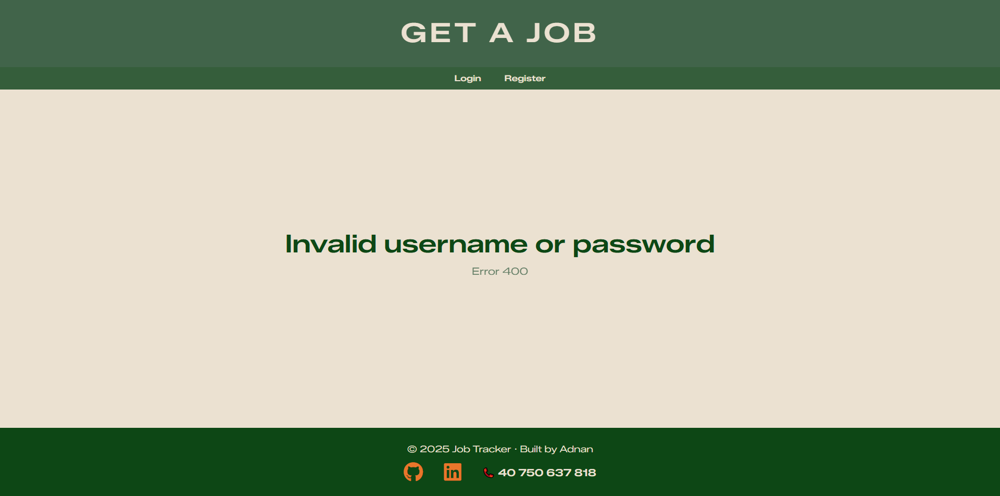
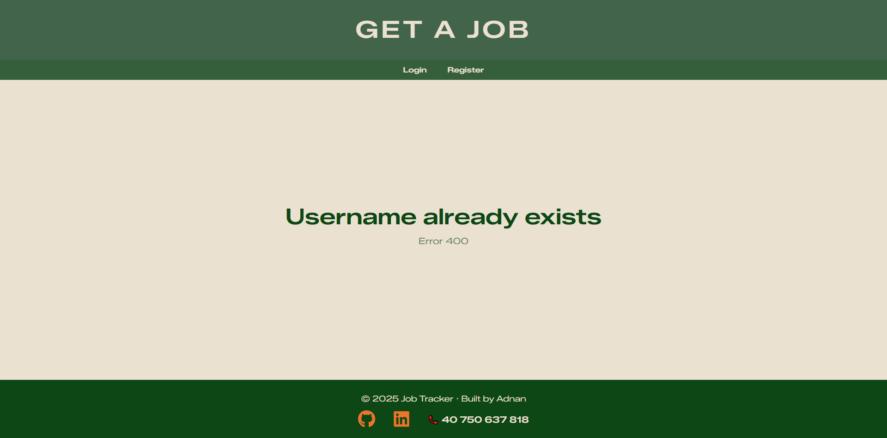
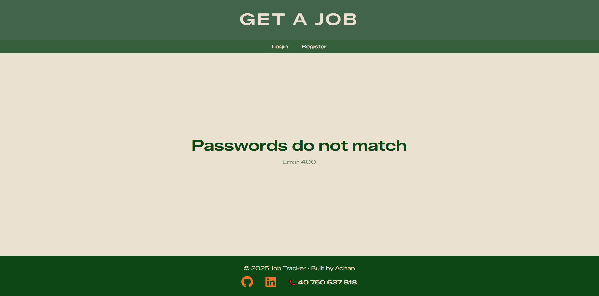

# Job Tracker – Flask Web Application

A full-stack web application that helps users track their job, internship, and part-time applications in one place.
The app allows users to register, log in, manage applications, update their status, and visualize progress through charts.
---
## Features

- User authentication (Register / Login / Logout)
- Add job applications with:
  - Company name
  - Position
  - Job type (Internship / Full-time / Part-time)
  - Application status
- Edit application status
- Dashboard displaying all applications
- Data visualization with charts
- Centralized error handling with a custom error page
- Clean and responsive UI with fixed header and footer
---
## Tech Stack

- **Backend:** Python, Flask
- **Database:** SQLite
- **Frontend:** HTML, CSS
- **Charts:** Chart.js
- **Version Control:** Git & GitHub
---

##  Screenshots

### Dashboard

### Edit Applications

### Charts

### Login

### register

### Error Page

### Error Page

### Error Page

## Setup Instructions

Clone the repository:
git clone https://github.com/YOUR_USERNAME/job-tracker-flask.git
cd job-tracker-flask
---
Install dependencies:
pip install -r requirements.txt
---
Run the application:
python app.py
----
Open your browser and go to:
http://127.0.0.1:5000
---

##Author:

Adnan Adi,

a Computer Science student 

Built as a personal project to showcase full-stack web development skills using Flask.
---

##License:
This project is licensed under the MIT License.
